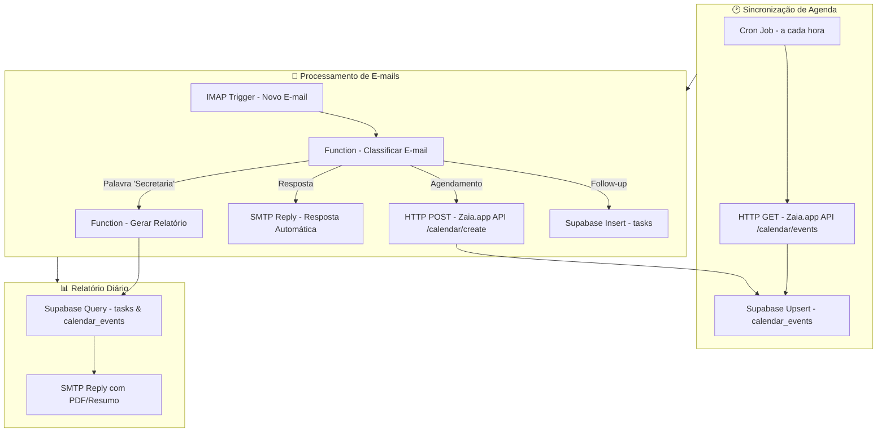

# 🤖 Projeto: Agent SecretaryV1.0.0

## Objetivo
Automatizar funções de secretaria executiva usando **Zaia.app (Google Calendar API)**, **Supabase** e **n8n** para:

- Gerenciar agenda de compromissos.
- Registrar tarefas e follow-ups.
- Ler e responder e-mails automaticamente.
- Gerar relatórios diários quando solicitado com a palavra secreta **“Secretaria”**.

---

## ⚙️ Componentes do Sistema

1. **Zaia.app / Google Calendar API**
   - Criação, atualização e cancelamento de eventos.
   - Consulta da agenda para evitar conflitos.
   - Retorno em JSON com `event_id`, `summary`, `start` e `end`.

2. **Supabase**
   - Armazena:
     - Tarefas do dia (`tasks`)
     - Eventos sincronizados (`calendar_events`)
     - Logs de e-mails (`email_logs`)

3. **n8n**
   - Orquestrador principal:
     - Recebe e-mails (IMAP)
     - Consulta e atualiza Supabase
     - Chama API do Zaia.app
     - Envia respostas via SMTP

---

## 🔄 Fluxo do Sistema

1. **Sincronização da Agenda**
   - **Cron Node** dispara a cada hora.
   - **HTTP Node** chama a API do **Zaia.app**:  
     `GET https://api.zaia.app/calendar/events?token=<API_KEY>`
   - **Supabase Node** faz `upsert` na tabela `calendar_events`.

2. **Checagem e Processamento de E-mails**
   - **IMAP Trigger** lê novas mensagens.
   - **Function Node** classifica a mensagem:
     - Solicitação de reunião → Cria evento no Zaia.app.
     - Follow-up → Cria tarefa no Supabase.
     - Palavra secreta **“Secretaria”** → Gera relatório do dia.

3. **Criação de Tarefas**
   - **Supabase Insert** salva detalhes em `tasks`.
   - Tarefas com `waiting_info` são sinalizadas para acompanhamento.

4. **Resposta Automática**
   - **SMTP Node** envia e-mail de confirmação ou lembrete.
   - **Optional AI Node** gera mensagens mais naturais e profissionais.

---

## 📊 Diagrama Mermaid do Fluxo



## 🔑 Observações Técnicas
Zaia.app API Endpoints usados:
```
GET /calendar/events → Consulta agenda
POST /calendar/create → Cria evento
DELETE /calendar/event/:id → Cancela evento
```
## E-mails:
- Recebidos via IMAP Trigger
- Respondidos via SMTP Node

## Relatórios:
- Gerados sob demanda quando palavra "Secretaria" for detectada
